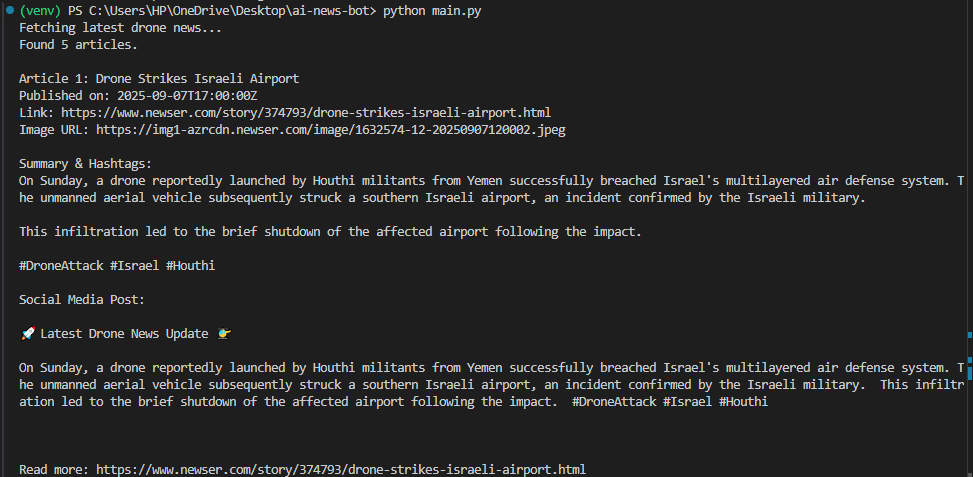
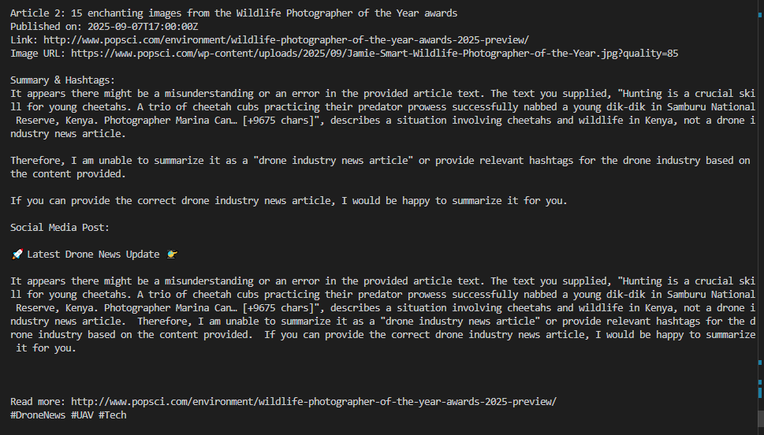

# Drone News Summarizer

An AI-powered bot that fetches the latest drone industry news from NewsAPI, summarizes articles using Google Gemini generative AI, and generates formatted social media posts.

---

## Features

- Fetches recent news articles related to drones using NewsAPI.
- Summarizes news articles into concise 2-3 paragraph summaries using Google Gemini (Google GenAI).
- Extracts relevant hashtags for social media sharing.
- Formats social media-ready posts including summaries and source links.

---

## Demo Screenshots

### Example: Article Fetching and Summary Output

---

## Technologies Used

- Python 3.9+
- [Google GenAI Python SDK](https://github.com/googleapis/python-genai)
- [NewsAPI](https://newsapi.org/)
- `requests`, `python-dotenv` for API interactions and environment variable management.

---

## Getting Started

### Prerequisites

- Python 3.9 or higher (recommended versions 3.9-3.11)
- Google Cloud account with Google Gemini (Generative AI) API access
- NewsAPI account for news data

### Installation

1. Clone the repo:

git clone https://github.com/jagritbhatia/drone-news-summarizer.git
cd drone-news-summarizer

2. Create and activate a virtual environment:

python -m venv venv
source venv/bin/activate # On Windows: venv\Scripts\activate

3. Install dependencies:

pip install -r requirements.txt

4. Create a `.env` file in the project root with the following content:

GEMINI_API_KEY=your_google_gemini_api_key_here
NEWS_API_KEY=your_news_api_key_here

5. Run the bot:

python main.py

---

Thank you for visiting the repository! 🚀
